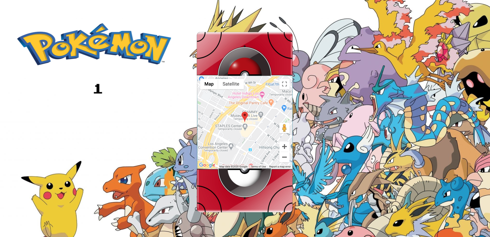

# Pokemon Animation (Mini Project)

A mini passion project of mine where I got to practice my jQuery and CSS skills with a Google Maps API feature. 

Designed and built a Pokedex that opens, closes, and shows a specific map location based off the user's selection. 

## Live Demo

https://pokedex-animation.timothywlee.com/

## Technologies Used

- JavaScript
- jQuery
- HTML5
- CSS3
- Photoshop
- Google Maps API

## Features

- User can choose a location for a Pokemon battle

## Features to complete

- Make webpage responsive to all browsers, desktop, mobile, and tablets devices

## Preview


## Getting Started
1. Clone the repository
``` 
git clone https://github.com/timothywlee/pokemon-animation
cd pokemon-animation
```
2. Run default server 
```
Go to the index.html file
Right click and run live default server 
```
